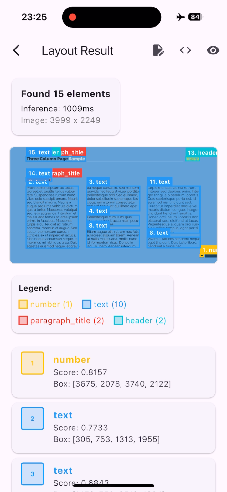
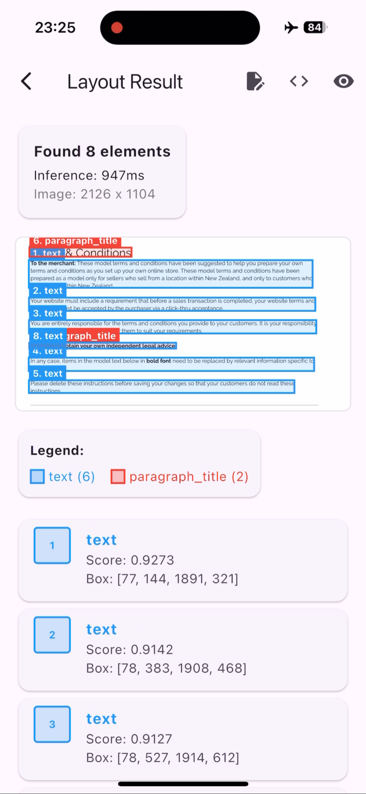
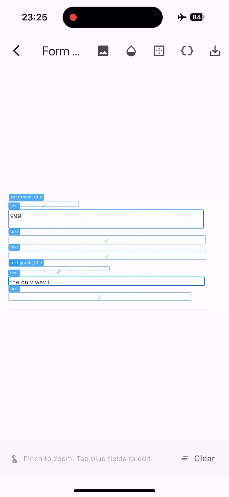
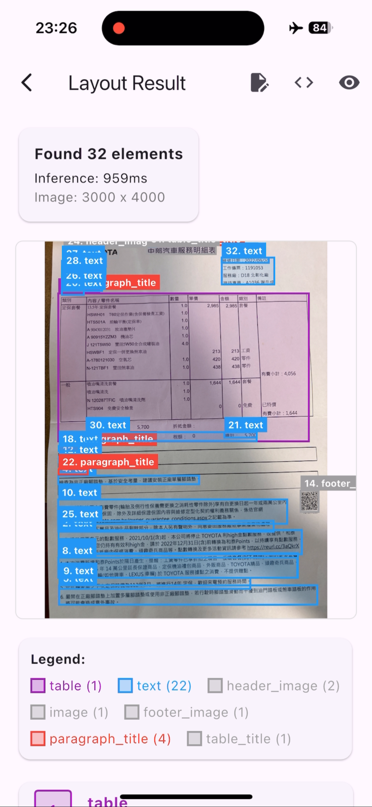
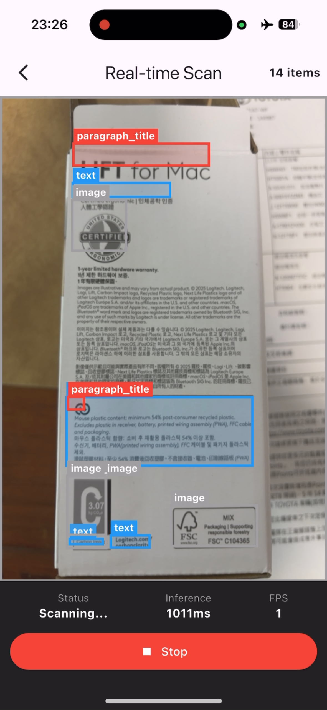

# Flutter DocLayout Kit

A Flutter plugin for document layout detection using PP-DocLayout model. This plugin provides on-device AI-powered document analysis for iOS and Android.

## Screenshots

### End-to-end document layout workflow

<table>
  <tr>
    <td align="center">
      
      <br/>
      <sub><b>1. Offline layout</b><br/>On-device layout inference (~1s per image), no network required.</sub>
    </td>
    <td align="center">
      
      <br/>
      <sub><b>2. Static detection</b><br/>Analyzes document structure from test images (titles, text, tables, images).</sub>
    </td>
  </tr>
  <tr>
    <td align="center">
      
      <br/>
      <sub><b>3. Form reconstruction</b><br/>Turns detected layout blocks into editable fields and HTML-friendly structure.</sub>
    </td>
    <td align="center">
      
      <br/>
      <sub><b>4. Camera capture</b><br/>Capture photos and preview layout boxes directly in the camera view.</sub>
    </td>
  </tr>
  <tr>
    <td align="center" colspan="2">
      
      <br/>
      <sub><b>5. Real-time scan</b><br/>Continuous layout detection on live camera frames for scanning workflows.</sub>
    </td>
  </tr>
</table>

## Demo Video

https://github.com/user-attachments/assets/7c348a4a-675f-46d2-b8a2-f798082b5245

## Features

- On-device document layout detection (no internet required)
- Detects 23 document element types (text, images, tables, formulas, etc.)
- High-performance native implementation using ONNX Runtime
- Supports image file and raw bytes input
- Cross-platform: iOS and Android

## Supported Document Elements

| ID | Element Type | ID | Element Type |
|----|--------------|----| -------------|
| 0 | paragraph_title | 12 | footnote |
| 1 | image | 13 | header |
| 2 | text | 14 | algorithm |
| 3 | number | 15 | footer |
| 4 | abstract | 16 | seal |
| 5 | content | 17 | chart_title |
| 6 | figure_title | 18 | chart |
| 7 | formula | 19 | formula_number |
| 8 | table | 20 | header_image |
| 9 | table_title | 21 | footer_image |
| 10 | reference | 22 | aside_text |
| 11 | doc_title | | |

## Installation

### 1. Add Dependency

**From pub.dev (recommended):**
```yaml
dependencies:
  flutter_doclayout_kit: ^1.0.0
```

**Or from GitHub:**
```yaml
dependencies:
  flutter_doclayout_kit:
    git:
      url: https://github.com/robert008/flutter_doclayout_kit.git
```

### 2. Download AI Model

Download the ONNX model from [GitHub Releases](https://github.com/robert008/flutter_doclayout_kit/releases):

| Model | Size | Description |
|-------|------|-------------|
| pp_doclayout_m.onnx | 22 MB | Medium model (faster) |
| pp_doclayout_l.onnx | 123 MB | Large model (more accurate) |

**Steps:**

1. Create `assets/` folder in your project root
2. Download the model file and place it in `assets/`
3. Register in `pubspec.yaml`:

```yaml
flutter:
  assets:
    - assets/pp_doclayout_m.onnx
```

Your project structure should look like:
```
your_app/
  assets/
    pp_doclayout_m.onnx    <-- AI model here
  lib/
  pubspec.yaml
```

### 3. Platform Setup

**iOS**: Run `pod install` in your iOS directory. The native library will be downloaded automatically.

**Android**: The native library will be downloaded automatically on first build.

## Usage

### Basic Usage

```dart
import 'package:flutter_doclayout_kit/flutter_doclayout_kit.dart';

// Initialize with model path
final modelPath = await getModelPath(); // Get from your assets
DocLayoutKit.init(modelPath);

// Detect from image file
final result = DocLayoutKit.detectFromFile(
  '/path/to/document.jpg',
  confThreshold: 0.5,
);

// Process results
if (result.isSuccess) {
  print('Found ${result.count} elements');
  print('Inference time: ${result.inferenceTimeMs}ms');

  for (final box in result.detections) {
    print('${box.className}: ${box.score.toStringAsFixed(2)}');
    print('  Position: (${box.x1}, ${box.y1}) - (${box.x2}, ${box.y2})');
  }
}
```

### Detect from Camera/Memory

```dart
// For camera frames or in-memory images
final result = DocLayoutKit.detectFromBytes(
  imageBytes,
  width: 1920,
  height: 1080,
  channels: 3, // RGB
  confThreshold: 0.5,
);
```

### Filter Results

```dart
// Filter by element type
final tables = result.filterByClass(DocLayoutClass.table);
final images = result.filterByClass(DocLayoutClass.image);

// Filter by confidence score
final highConfidence = result.filterByScore(0.8);
```

## API Reference

### DocLayoutKit

| Method | Description |
|--------|-------------|
| `init(String modelPath)` | Initialize with ONNX model path |
| `detectFromFile(String path, {double confThreshold})` | Detect from image file |
| `detectFromBytes(Uint8List data, {int width, int height, int channels, double confThreshold})` | Detect from raw bytes |
| `isInitialized` | Check if initialized |
| `version` | Get library version |

### DetectionResult

| Property | Type | Description |
|----------|------|-------------|
| `detections` | `List<DetectionBox>` | List of detected elements |
| `count` | `int` | Number of detections |
| `inferenceTimeMs` | `int` | Inference time in ms |
| `imageWidth` | `int` | Original image width |
| `imageHeight` | `int` | Original image height |
| `isSuccess` | `bool` | Check if successful |
| `hasError` | `bool` | Check if has error |

### DetectionBox

| Property | Type | Description |
|----------|------|-------------|
| `x1, y1, x2, y2` | `double` | Bounding box coordinates |
| `score` | `double` | Confidence score (0-1) |
| `classId` | `int` | Element class ID (0-22) |
| `className` | `String` | Element class name |
| `layoutClass` | `DocLayoutClass?` | Enum value |

## Requirements

- Flutter >= 3.3.0
- Dart >= 3.0.0
- iOS >= 12.0
- Android minSdk >= 21

## Run Example App

```bash
git clone https://github.com/robert008/flutter_doclayout_kit.git
cd flutter_doclayout_kit/example
flutter run
```

The example app will automatically download the required model and native libraries.

## Building from Source

If you want to build the native libraries yourself, the C++ source code is available in the `src/` directory.

## Author

**Robert Chuang**
- Email: figo007007@gmail.com
- LinkedIn: https://www.linkedin.com/in/robert-chuang-88090932b

## License

Apache License 2.0

See [LICENSE](LICENSE) for details.

## Related Projects

- [flutter_document_capture](https://github.com/robert008/flutter_document_capture) - Document capture preprocessing (corner detection, perspective correction)
- [flutter_ocr_kit](https://github.com/robert008/flutter_ocr_kit) - OCR + Layout Detection

## Acknowledgments

- [PP-DocLayout](https://github.com/PaddlePaddle/PaddleOCR) - Document layout analysis model by PaddlePaddle
- [ONNX Runtime](https://onnxruntime.ai/) - Cross-platform inference engine
- [OpenCV](https://opencv.org/) - Image processing library
